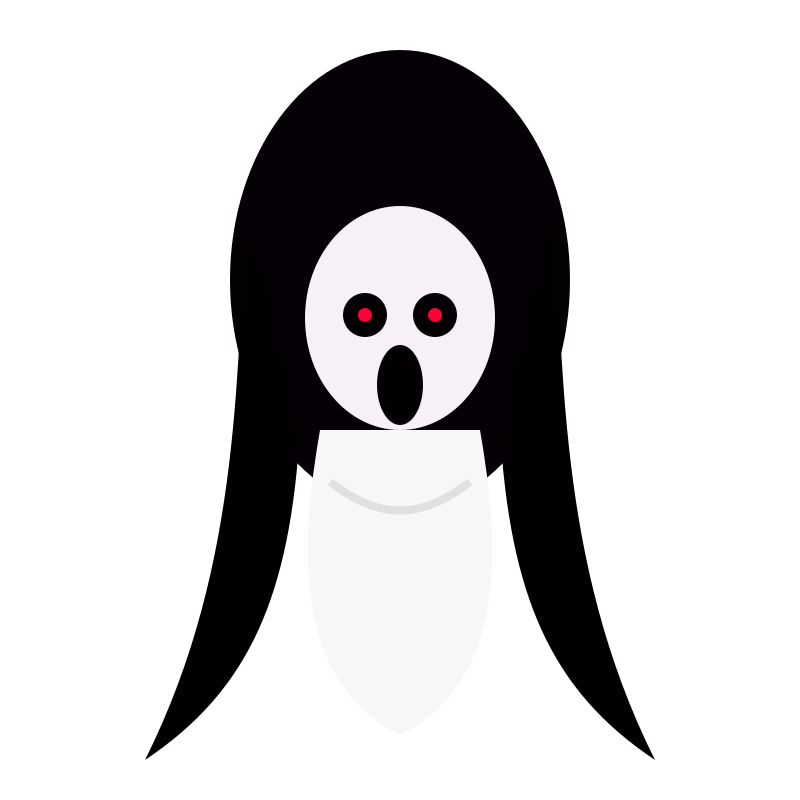

<!doctype html>
<html lang="id">
<head>
  <meta charset="utf-8" />
  <meta name="viewport" content="width=device-width, initial-scale=1" />
  <title>Jogja After Dark — 3D Drive Horror Experience</title>
  <link rel="stylesheet" href="css/style.css" />
</head>
<body>
  <main id="app" aria-label="Jogja After Dark 3D">
    <canvas id="worldCanvas"></canvas>

    <section id="introGate" class="intro-gate">
      

        
3D HORROR DRIVE EXPERIENCE

        <h1>JOGJA AFTER DARK</h1>
        <h2>Drive Through the Haunted City</h2>
        

          Jelajahi kota horor 3D dengan mobil, temukan urban legend Jogja, masuk zona rawan,
          kumpulkan relik, dan gunakan safe zone untuk menurunkan Danger Meter.
        

        <button id="enterBtn" class="primary-btn">Masuk ke Kota Gelap</button>
        <small>Kontrol: WASD/Arrow untuk jalan, Shift boost, Space lompat, Enter interaksi, R respawn, M mute.</small>
      

    </section>

    

    

    

    

    
JANGAN KELUAR JALUR

    

      
      
KUNTILANAK

    

    <aside id="heroPanel" class="panel hero-panel draggable">
      
☰ Jogja After Dark

      <h1>3D Haunted City Drive</h1>
      
Versi 3D game-like: mobil bisa dikendarai seperti world interaktif, bukan hanya peta statis.

      
Three.jsDriving WorldUrban LegendMini Game

    </aside>

    <aside id="legendPanel" class="panel legend-panel draggable">
      
☰ Arsip Urban Legend

      <input id="searchInput" placeholder="Cari: Tugu, Tamansari, Alkid..." />
      

    </aside>

    <aside id="controlPanel" class="panel control-panel draggable">
      
☰ Control Center

      

        SKENARIO AKTIF
        <h2 id="scenarioTitle">Mode Drive Horor</h2>
        
Kendarai mobil ke ikon urban legend. Tekan ENTER saat dekat lokasi.

      

      

        
<b id="mSpeed">0</b>km/jam

        
<b id="mLegend">10</b>lokasi

        
<b id="mRelic">0/5</b>relik

        
<b id="mSanity">100</b>sanity

      

      

        
<b>Danger Meter</b>0%

        

        <small>Naik saat mobil berada di zona merah, menabrak trap, atau terlalu lama idle di area rawan.</small>
      

      <h3>Mode Interaktif</h3>
      <button id="kliwonBtn" class="danger-btn">🌑 Aktifkan Malam Jumat</button>
      <button id="ghostHuntBtn" class="purple-btn">🔦 Ghost Hunt Mode</button>
      <button id="miniGameBtn" class="green-btn">🎮 Mulai Mini Game Relik</button>
      <button id="qualityBtn" class="blue-btn">⚙️ Quality: High</button>
      <button id="cameraBtn" class="blue-btn">🎥 Kamera: Follow</button>

      <h3>Kontrol Cepat</h3>
      <button id="respawnBtn" class="dark-btn">📍 I'm Stuck / Respawn</button>
      <button id="resetBtn" class="dark-btn">↻ Reset World</button>
      <button id="muteBtn" class="dark-btn">🔊 Mute / Unmute</button>
      <button id="panicBtn" class="dark-btn">🧯 Matikan Efek</button>

      

        
Test efek opsional

        <button data-creature="kunti" class="test-scare">👻 Test Kunti</button>
        <button data-creature="pocong" class="test-scare">🧟 Test Pocong</button>
        <button data-creature="genderuwo" class="test-scare">👹 Test Genderuwo</button>
      

    </aside>

    <aside id="infoPanel" class="panel info-panel draggable">
      
☰ Info Lokasi

      

        <h2>Belum ada lokasi dipilih</h2>
        
Dekati ikon 3D urban legend dengan mobil. Tekan ENTER untuk membuka cerita, analisis spasial, dan safety note.

      

    </aside>

    <section id="driveHud" class="drive-hud">
      
Cari titik urban legend terdekat

      
0<small>km/jam</small>

      

        WASD / Arrow: Drive
        SHIFT: Boost
        SPACE: Jump
        ENTER: Interact
        R: Respawn
      

    </section>

    <section id="gamePanel" class="game-panel hidden">
      <b>🎮 MINI GAME: RELIK KUTUKAN</b>
      
Drive ke 5 relik emas. Hindari mata merah. Masuk safe zone untuk menurunkan danger.

      

      Relik: 0/5
    </section>

    <section class="map-legend">
      
Zona rawan 3D

      
Safe zone

      
Rute eksplorasi

      
🚗 Mobil eksplorasi

      
📿 Relik / 👁️ Trap

    </section>

    <canvas id="miniMap" width="180" height="180" aria-label="Mini map"></canvas>
    
Klik “Masuk ke Kota Gelap”.

  </main>

  
  
  
</body>
</html>
